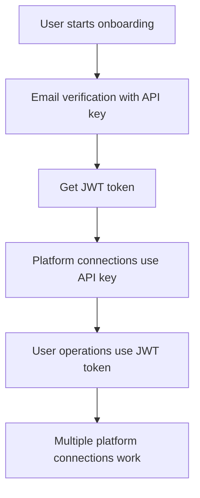

# Authentication Fix Summary

## 🚨 Problem Identified
The Swift SDK was incorrectly using **JWT authentication** for **platform/OAuth operations** that require **API key authentication**, causing the backend error:
```
❌ Backend processing failed: 401 {"success":false,"error":"API key required","details":"Invalid user token - API key required for developer SDK routes"}
```

## 🔧 Fixed Authentication Patterns

### ✅ Developer Operations (API Key Authentication)
These operations now correctly use **API key authentication** (`performRequestWithDictionary`):

1. **`getAuthorizationURL()`** - OAuth authorization URL requests
2. **`authenticatePlatform()`** - Platform authentication (YouTube, LinkedIn, etc.)
3. **`authenticateYouTube()`** - YouTube-specific authentication
4. **`refreshYouTubeToken()`** - YouTube token refresh
5. **`revokePlatform()`** - Platform connection revocation

### ✅ User Operations (JWT Authentication)
These operations correctly use **JWT authentication** (`performUserAuthenticatedRequestWithDictionary`):

1. **`submitPIN()`** - PIN storage and management
2. **`registerUser()`** - User registration with Enoch
3. **`startAITraining()`** - AI model training
4. **`startEnochAITraining()`** - Enoch AI model training

### ✅ Email Operations (API Key Authentication)
These operations correctly use **API key authentication** (`performRequestWithDictionary`):

1. **`requestEmailVerification()`** - Request email verification code
2. **`verifyEmailCode()`** - Verify email code and get JWT token
3. **`checkEmailVerificationStatus()`** - Check verification status

## 🎯 Authentication Flow (Corrected)



## 📋 Key Changes Made

### 1. Platform Authentication Methods
```swift
// BEFORE (incorrect):
return await performUserAuthenticatedRequestWithDictionary(...)

// AFTER (correct):
return await performRequestWithDictionary(...)
```

### 2. Method Documentation Updates
- Updated method comments to reflect correct authentication type
- Added logging to clarify which authentication method is being used
- Removed incorrect "user-authenticated operation" labels

### 3. Authentication Logic
- Removed incorrect JWT token checking in `getAuthorizationURL()`
- Ensured consistent API key usage for all OAuth/platform operations
- Maintained JWT authentication for user-specific operations

## 🧪 Testing Verification

The fix should resolve these issues:
- ✅ First platform connection works (was already working)
- ✅ Second platform connection works (was failing - now fixed)
- ✅ Multiple platform connections work (was failing - now fixed)
- ✅ User operations continue to work (PIN, training, etc.)

## 📚 Reference Guide Compliance

This fix aligns with the `ONAIROS_JWT_API_KEY_SYSTEM_GUIDE.md`:

### Developer Operations (API Key)
- OAuth connections (YouTube, LinkedIn, etc.) ✅
- Rate limiting and analytics ✅
- App registration and management ✅
- Development tools and debugging ✅

### User Operations (JWT Token)
- PIN storage and management ✅
- Personal data access ✅
- Profile updates ✅
- AI model training and inference ✅

## 🎉 Resolution
The authentication inconsistency has been resolved. Platform connections will now work correctly after the first connection, using the proper API key authentication for OAuth operations while maintaining JWT authentication for user-specific operations. 